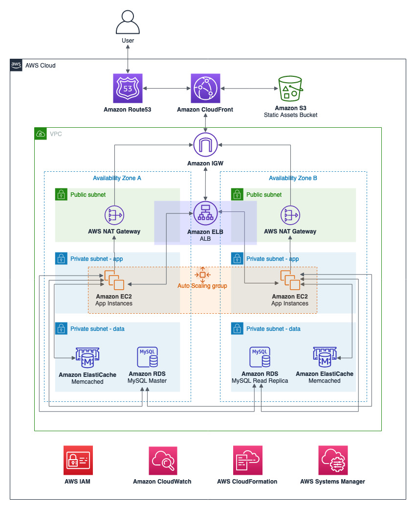
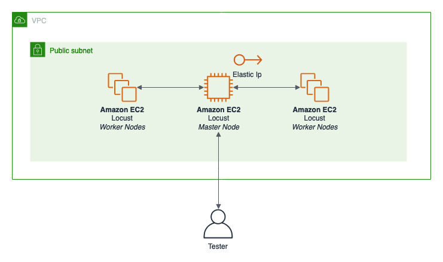

# AWS EC2 AutoScaling PHP App Demo

The purpose of this demo is show how to use some AWS services to create a scalable architecture. We are going to create a web app architecture and do a load test.

The architecture above shows a VPC separating the subnets in public and private subnets, a high scalable application layer utilizing AutoScaling and a high scalable data layer with managed cache service **(Amazon ElastiCache)** to store sessions and managed relational database service **(Amazon RDS)** with replicas to scale reads. Also, we are storing static assets in a bucket **(Amazon S3)** and utilizing a CDN **(Amazon CloudFront)** to deliver the static assets and minimize latency to deliver dynamic content.

To test the application architecture we are utilizing the tool **Locust**, an open source load testing tool, to simulate users acessing our workload.

To get started you will need an IAM user with the following access:

* CloudFormation
* EC2
* CloudFront
* ElastiCache
* RDS
* S3
* VPC
* CloudWatch
* Route53
* IAM

__Notes:__ 
* __Tested in the N. Virginia region (us-east-1);__
* __CF is just creating two subnets (public, private-app), different from the architecture;__
* __RDS is not implemented yet to test Read Replicas.__

## App CloudFormation
1. Download the repository or copy the CloudFormation template **template-app.yml** at cf-templates folder;
2. Open the CloudFormation console at https://console.aws.amazon.com/cloudformation
3. On the Step 1 - Specify template: Choose Upload a template file, click on Choose file button and select the **template-app.yml** located inside deploy directory
4. On the Step 2 - Specify stack details: Enter the Stack name as **'scaling-web'**
5. On the Step 3 - Configure stack options: Just click on Next button
6. On the Step 4 - Review: Enable the checkbox I acknowledge that AWS CloudFormation might create IAM resources with custom names., and click on Create Stack button
7. Wait for the stack get into status CREATE_COMPLETE
8. Under the Outputs tab, _take a note_ of **ELB value**
9. Open in a new tab the app utilizing the **ELB** DNS

## Load CloudFormation
1. Download the repository or copy the CloudFormation template **template-test.yml** at cf-templates folder;
2. Open the CloudFormation console at https://console.aws.amazon.com/cloudformation
3. On the Step 1 - Specify template: Choose Upload a template file, click on Choose file button and select the **template-test.yml** located inside deploy directory
4. On the Step 2 - Specify stack details: Enter the Stack name as **'locust'** and change the parameter **TargetEndpoint** utilizing the **ELB value** noted at the first stage. For example: **http://www.yourwebsite.com**
5. On the Step 3 - Configure stack options: Just click on Next button
6. On the Step 4 - Review: Enable the checkbox I acknowledge that AWS CloudFormation might create IAM resources with custom names., and click on Create Stack button
7. Wait for the stack get into status CREATE_COMPLETE
8. Under the Outputs tab, _take a note_ of **Locust master instance DNS**
9. Open in a new tab the locust page utilizing the **DNS** noted

## Testing
1. Now, you are going to do some load test to see the behavior of the application
2. On the **Locust** page, after the number of slaves is the total you asked for, start simulating _10000 users_ with a _hacth rate of 50_
3. Look at the CloudWatch metrics of **Application Load Balancer** and **EC2** to see how it works
4. Repeat the test with different parameters to collect more metrics if necessary

## Launch Template
1. Go to EC2 console at https://console.aws.amazon.com/ec2
2. Go to your **AppInstance**, Actions, Instance setting and copy the user data
3. Create a new **Launch Template**
4. Select **Amazon Linux 2 64-bit (x86)** at Amazon machine image (AMI) field
5. On Instance type select **t3.micro**
6. At the networking stage select **VPC** and **WebSg**
7. Add new tag _Name_ with value of **webapp**
8. Go to Advanced Details and paste the **user data**
9. Click on **Create**

## AutoScaling
1. Go to **AutoScaling group** and click on create
2. Select **Launch Template** and filter your launch template created on the step before
3. On the **Network** stage, select the app VPC **E.g.:stackname_VPC**
4. Selct **Private1** and **Private2** subnets
5. At the Advanced Details, check _Receive traffic from one or more load balancers_ and select the **tg-app** target group
6. Check **Health Check** as **ELB**
7. Go to Review and Create
8. Now, we can create a new CloudWatch alarm and associate with the AutoScaling
9. Go to https://console.aws.amazon.com/cloudwatch
10. Select **Alarms** and create a new one
11. Select the metrics you want, on this example, we are going to select **ApplicationELB -> Per AppELB -> TargetResponseTime**
12. Minimize period to 1 minute and on conditions put greater than **0.3**
13. Next, create a new SNS topic with your email and create
14. Open a new tab, go to AutoScaling Group that we created
15. Select **Scaling Policies** and Add Policy
16. Slect __Create a scaling policy with steps__ and select the alarm you created
17. at **Take Action** Add two new instances and create
18. Edit you AutoScaling group and change **Max** to 5
18. You can do the same to remove instances when the alarm do not shoot

## Testing
1. Open the **Locust** page
2. Create a new test with more users and see the application scaling

## Next Steps
* We are not utilizing on this demo, but, **CloudFront** could minimize the load on the EC2 instances, delivering the static content
* We are utilizing **t3.micro** instances, we need to do a resizing based on the application behavior and number of users
* To utilize your domain, we could use **Route53**
* On the **Reference links** you can find some great getting started guid to help you setup Route53 and CloudFront

## Clean up
1. Delete the resources that you created (Route53, CloudFront, AutoScaling, CloudWatch)
2. Open the CloudFormation console at https://console.aws.amazon.com/cloudformation
3. Select the CloudFormation stack and click on Delete button

## Reference links
* Scaling up to your first 10 million users: https://www.youtube.com/watch?v=Ma3xWDXTxRg
* Getting started AutoScaling: https://docs.aws.amazon.com/autoscaling/ec2/userguide/GettingStartedTutorial.html
* Locust: https://docs.locust.io/en/stable/
* Getting started with CloudFront: https://docs.aws.amazon.com/AmazonCloudFront/latest/DeveloperGuide/GettingStarted.html
* Getting started with Route53: https://docs.aws.amazon.com/Route53/latest/DeveloperGuide/getting-started.html

## License summary
This sample code is made available under the MIT-0 license. See the LICENSE file.
